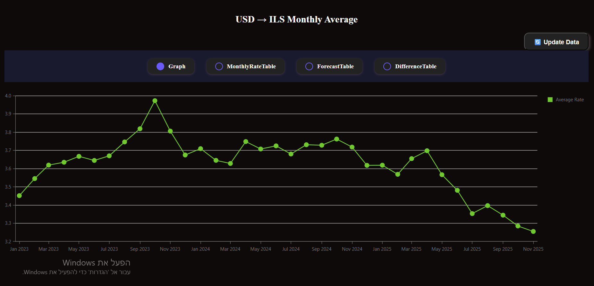

# USD → ILS Monthly Rates

## Description

---
This project is a web application that tracks and
displays the USD to ILS
exchange rate starting from January 2023.

The data is automatically updated on the
first day of each month
for the previous month.

The website includes:

- A graph displaying monthly average exchange
rates
- A searchable and filterable table by month
- An additional table with forecasts,
differences, and weighted differences



## Tech Stack

- TypeScript
- Node.js 20
- React + Vite
- Docker & Docker Compose

---

## Diagram of the project structure

```text

DOLAR-TASK/
│
├─ .github/
│  └─ workflow/
│     └─ ci.yml
│
├─ asset/
│  └─ MonthlyRates.png
│
├─ client/
│  │
│  ├─ src/
│  │  │
│  │  ├─ api/
│  │  │  └─ ratesApi.ts
│  │  │
│  │  ├─ components/
│  │  │  ├─ Dashboard/
│  │  │  │  ├─ Dashboard.tsx
│  │  │  │  ├─ Dashboard.css
│  │  │  │  └─ RenderView.tsx
│  │  │  │
│  │  │  ├─ Graph/
│  │  │  │  └─ Graph.tsx
│  │  │  │
│  │  │  ├─ Table/
│  │  │  │  ├─ DifferenceTable.tsx
│  │  │  │  ├─ ForecastTable.tsx
│  │  │  │  ├─ MonthlyRateTable.tsx
│  │  │  │  ├─ FilterControls.tsx
│  │  │  │  ├─ FilterControls.css
│  │  │  │  └─ Table.css
│  │  │  │
│  │  │  └─ ViewSelector/
│  │  │     ├─ ViewSelector.tsx
│  │  │     └─ ViewSelector.css
│  │  │
│  │  ├─ types/
│  │  │  └─ type.ts
│  │  │
│  │  ├─ utils/
│  │  │  ├─ addAvgDifference.ts
│  │  │  ├─ addDifferences.ts
│  │  │  ├─ addForecast.ts
│  │  │  ├─ addMultiplication.ts
│  │  │  ├─ getGateColor.ts
│  │  │  ├─ loadRates.ts
│  │  │  └─ processData.ts
│  │  │
│  │  ├─ App.tsx
│  │  └─ index.tsx
│  │
│  ├─ tests/
│  │  └─ utils/
│  │     ├─ addAvgDifference.test.ts
│  │     ├─ addDifference.test.ts
│  │     ├─ addForecast.test.ts
│  │     ├─ addMultiplication.test.ts
│  │     ├─ getGateColor.test.ts
│  │     └─ processData.test.ts
│  │
│  ├─ .env
│  ├─ .env.sample
│  ├─ Dockerfile
│  ├─ eslint.config.js
│  ├─ index.html
│  ├─ jest.config.cjs
│  ├─ package.json
│  ├─ tsconfig.json
│  └─ vite.config.ts
│
├─ server/
│  │
│  ├─ src/
│  │  │
│  │  ├─ api/
│  │  │  └─ ratesApi.ts
│  │  │
│  │  ├─ db/
│  │  │  ├─ init.sql
│  │  │  ├─ insertRate.ts
│  │  │  └─ pool.ts
│  │  │
│  │  ├─ routers/
│  │  │  └─ sqlRouter.ts
│  │  │
│  │  ├─ schedule/
│  │  │  └─ monthlyJob.ts
│  │  │
│  │  ├─ utils/
│  │  │  ├─ calculateMonthlyAvg.ts
│  │  │  ├─ calculateMonthlyAvgHistory.ts
│  │  │  ├─ fetchMonthlyRates.ts
│  │  │  └─ sendMonthlyAvgToDb.ts
│  │  │
│  │  ├─ app.ts
│  │  └─ server.ts
│  │
│  ├─ tests/
│  │  │
│  │  ├─ api/
│  │  │  └─ ratesApi.test.ts
│  │  │
│  │  ├─ db/
│  │  │  └─ insertRate.test.ts
│  │  │
│  │  ├─ router/
│  │  │  └─ sqlRouter.test.ts
│  │  │
│  │  ├─ schedule/
│  │  │  └─ monthlyJob.test.ts
│  │  │
│  │  └─ utils/
│  │     ├─ calculateMonthlyAvg.test.ts
│  │     ├─ calculateMonthlyAvgHistory.test.ts
│  │     ├─ fetchMonthlyRates.test.ts
│  │     └─ sendMonthlyAvgToDb.test.ts
│  │
│  ├─ .env
│  ├─ .env.sample
│  ├─ Dockerfile
│  ├─ eslint.config.js
│  ├─ jest.config.js
│  ├─ package.json
│  └─ tsconfig.json
│
├─ .env
├─ .env.sample
├─ .gitignore
├─ docker-compose.yml
└─ README.md

```

## Run the project

Make sure Docker is installed and running.

```bash
docker compose up --build
```

Then open : <http://localhost:5173/>
